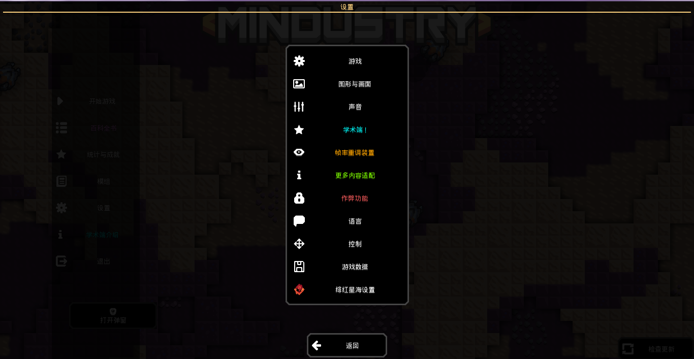

# 添加到设置栏按钮
***
实现效果:

## 1.使用
```text
Vars.ui.settings.addCategory
```
目前我建议使用
```text
addCategory(String name, @Nullable String region, Cons<SettingsTable> builder)
```
* name:设置名称
* region:图片文件名称(规格:模组名称-贴图名称)
* builder:点击设置后运行的代码

例如:
```text
Vars.ui.settings.addCategory(名称, 模组名称-贴图名称, settingsTable -> {
    settingsTable.pref(new SettingsMenuDialog.SettingsTable.Setting("name") {
        @Override
        public void add(SettingsMenuDialog.SettingsTable table) {
            //这里是写页面布置的
            table.row();
        }
    });
});
```
差不多，目前我不确定的是`SettingsMenuDialog.SettingsTable.Setting("name")`这似乎没有问题，因为在实际测试中没有出现什么改变，主要影响`name`变量

