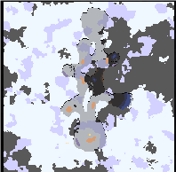

# 为区块创建预览图
***
效果`零号基地`预览图



## 1.使用

```java 
SectorPreset sector = SectorPresets.groundZero;

Pixmap pix = null;
try {
    pix = MapIO.generatePreview(sector.generator.map);
} catch (IOException e) {
    throw new RuntimeException(e);
}
```

## 2.原理
和[为地图创建预览图](为地图创建预览图.md)同理，不过臭猫有提供加载本地地图的方法。

类:`mindustry.type.SectorPreset`
```java 
/** Internal use only! */
public SectorPreset(String name){
    super(name);
    this.generator = new FileMapGenerator(name, this);
}
```

是的，仅供内部`*.msav`文件使用，不过本质一样，都是调用`MapIO.createMap()`方法。

类:`mindustry.maps.generators.FileMapGenerator`
```java 
public class FileMapGenerator implements WorldGenerator{
    public final Map map;
    public final SectorPreset preset;

    public FileMapGenerator(String mapName, SectorPreset preset){
        this.map = maps != null ? maps.loadInternalMap(mapName) : null;
        this.preset = preset;
    }
    
    ...
}
```

大概就这些...


