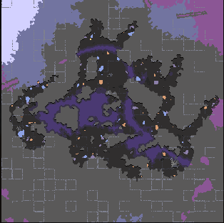

# 为区块存档创建预览图

我们可以在`Mindustry\saves`下得到
***
效果`175`预览图



## 1.使用

我们在加载区块时游戏会在`Mindustry\saves`创建一个格式名为`sector-星球-区块id.msav`，这是包含游戏数据的地图文件，所以我们可以使用[为地图创建预览图.md](为地图创建预览图.md)的方法创建，效果一样。

```java 
//获取175的Sector
var s = Planets.serpulo.sectors.get(175);

try {
    //获取在Mindustry\saves下的区块存档
    Map map = MapIO.createMap(s.save.file, true);
    Pixmap pix = MapIO.generatePreview(map);

    cont.add(new Image(new Texture(pix)));
} catch (IOException e) {
    throw new RuntimeException(e);
}
```

注意！需要在玩家加载地图后才能使用。并且存档的所有建筑也会绘制出来。
